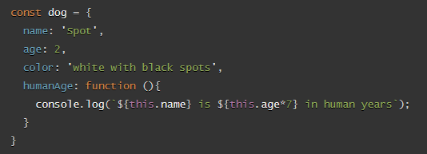

# Read 06 - Problem Domain, Objects, and the DOM

## JavaScript object basics

1. **_How would you describe an object to a non-technical friend you grew up with?_** - An object is kind of like an array in that is a single thing that stores amany things. information, arrays, functions (called methods in an object) and even other objects.
2. **_What are some advantages to creating object literals?_** - Object literals can be useful to store a lot of information inside one thing to be accessed later or passed to a complex function.
3. **_How do objects differ from arrays?_** - The main difference is that object properties are accessed by name rather than through their numbered index in the array.
4. **_Give an example for when you would need to use bracket notation to access an object’s property instead of dot notation._** - Bracket notation is useful for when setting a new property in a function, and when you want this property to have a name that is defined by a variable, rather than having a hardcoded name. e.g. `object[dataName] = dataValue;` will work as intended while `object.dataName = dataValue;` will not.
5. **_Evaluate the code below. What does the term `this` refer to and what is the advantage to using `this`?_**
   
   In this example the term `this` refers to the object. Using `this` is useful as it will refer to the object it is within under all circumstances, meaning we can write methods that call upon properties of their parent object even if many different objects contain identical code.

## Introduction To The DOM

1. **_What is the DOM?_** - The DOM is the document object model. It is the document that contains all of the structure and content information for the webpage. It represents the document as nodes and objects, allowing it to be mnipulated by code.
2. **_Briefly describe the relationship between the DOM and JavaScript._** The DOM can be changed and manipulated by JavaScript to dynamically alter the activity of the page.
