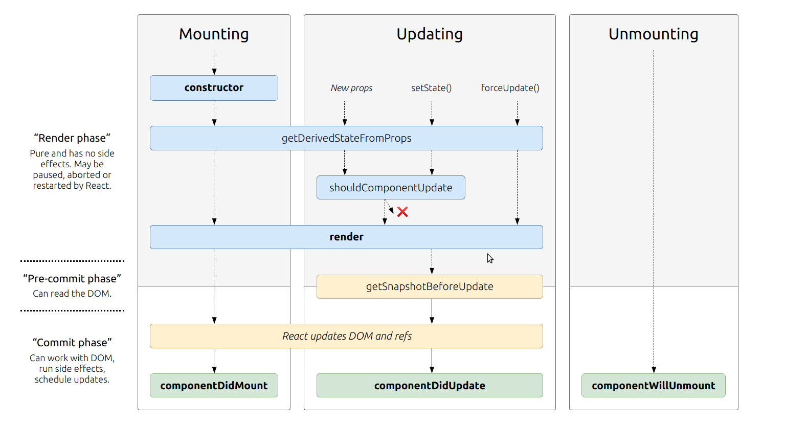

# Class 02 read: State and Props

## React lifecycle

1. **_Based off the diagram, what happens first, the ‘render’ or the ‘componentDidMount’?_** - render will happen first
2. **_What is the very first thing to happen in the lifecycle of React?_** - The componet is mounted to the DOM
3. **_Put the following things in the order that they happen: `componentDidMount`, `render`, `constructor`, `componentWillUnmount`, `React Updates`_**

- `constructor`
- `render`
- `React Updates`
- `componentDidMount`
- `componentWillUnmount`

4. **_What does `componentDidMount` do?_** - `componentDidMount` is invoked once a component is rendered to the DOM, so it can be utilised for bahaviors that muct happen after the component is rendered.

## React State Vs Props

1. **_What types of things can you pass in the props?_** - many things, such as variables and functions
2. **_What is the big difference between props and state?_** - Props are passed _into_ the component while state is _internal_.
3. **_When do we re-render our application?_** - Applications are re-rendered when state is updated.
4. **_What are some examples of things that we could store in state?_**

- The current count for some kind of counter (likes etc)
- The current state of a HTML form
